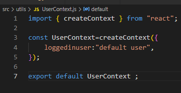
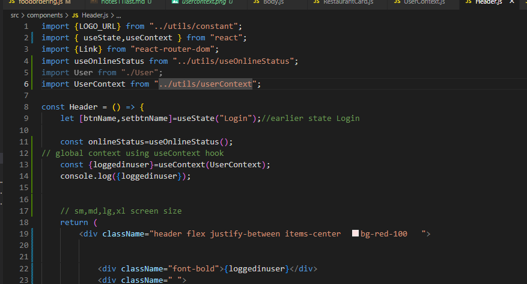
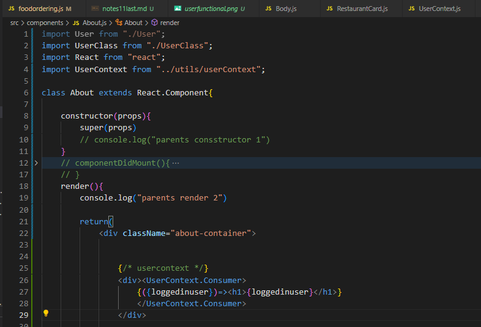
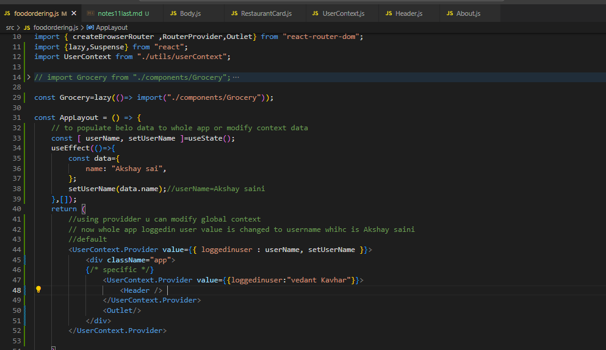
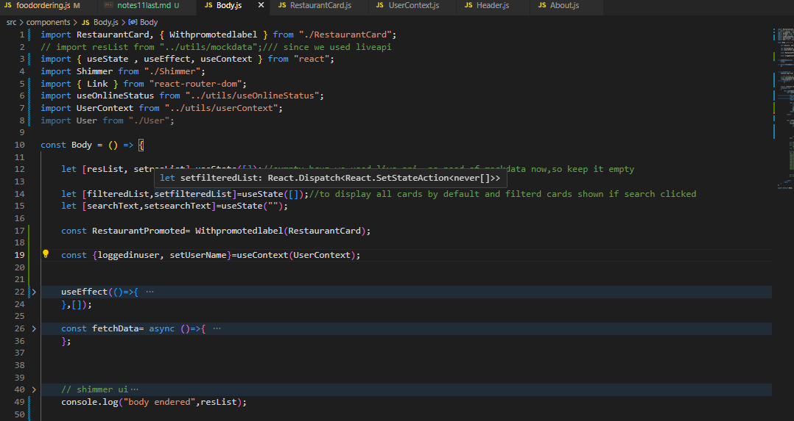
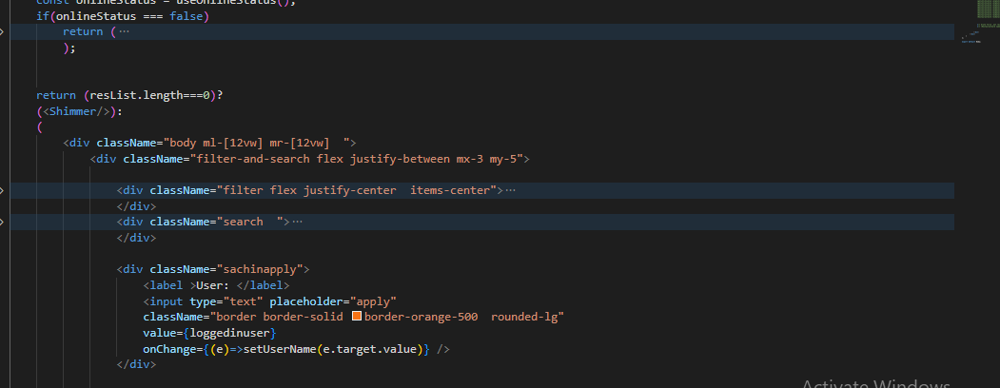

# Context
- usrcontext 

- use it in funcional comp using hook useContext( named)

- use in class based comp using Usercontexxt.consumer

- to modify usercontext and provide/apply usercontext globally /to whole app use usercontext.provider and pass value u want to apply 
- u can

- get input from user and that wrritten text/input apply all over app
- first pass setuserName to global .,whenever text change globally val changed

- take input onchange do apply(use hook,put new val)

