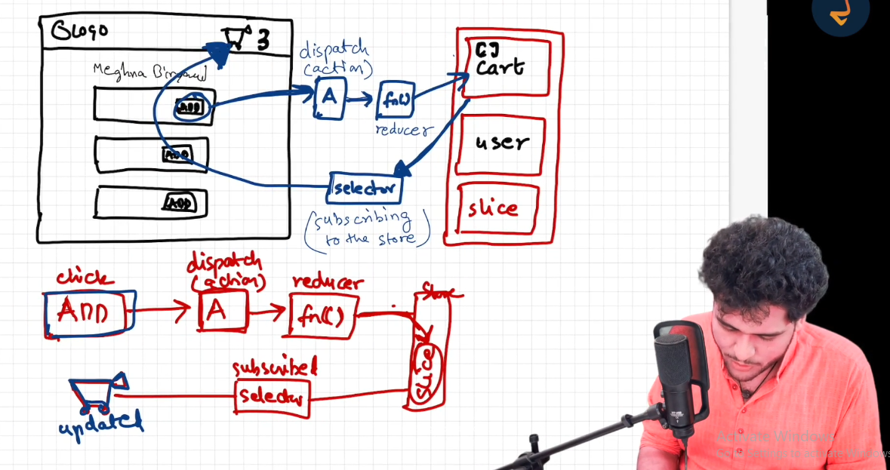
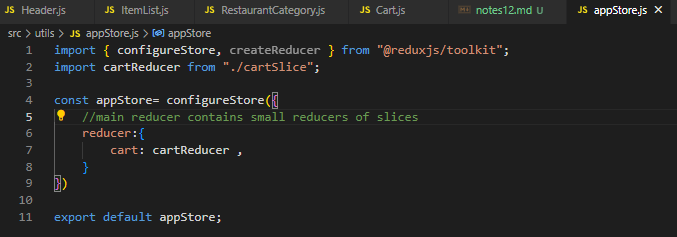
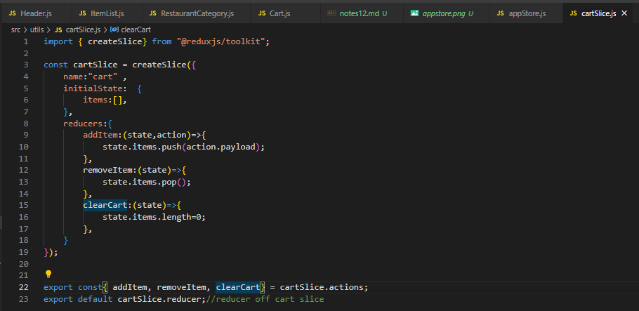
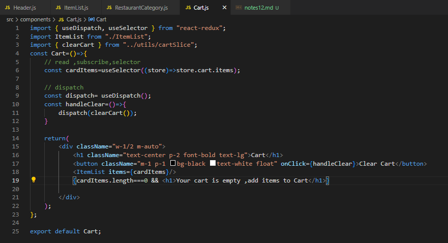
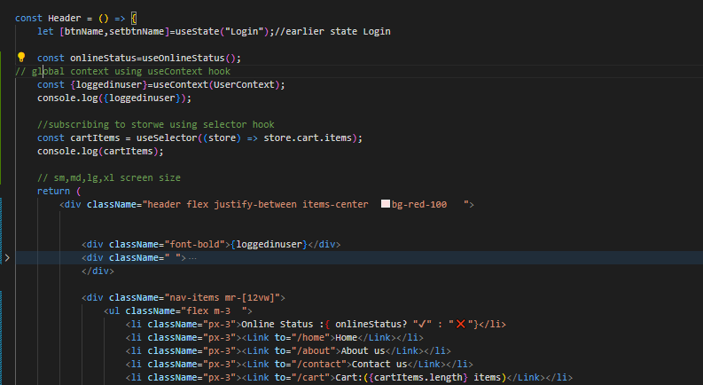
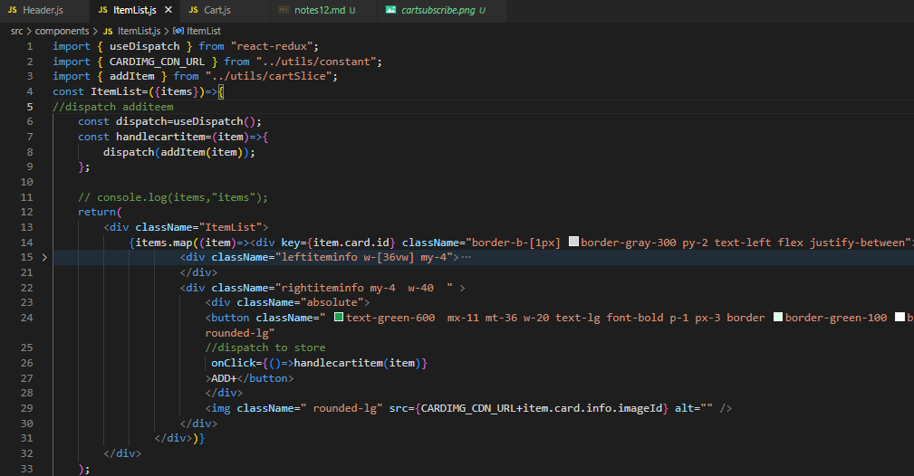

# 12 redux,redux toolkit
## read,write data from app to store
- 

- Appstore
- 

- cart slice
- 

### subscribe =selector
- cart subscribe-to read from store,show,cnt
- 
- 

### modify= Dispatch
- add,clearcart
- 

- to clear cartt just do make listofitems length ==0 
- 