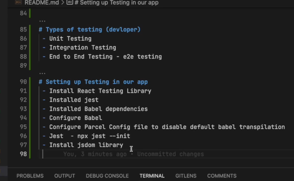

# testing the app
- 

- contact testing errr
- install @babel/preset-react //jsx to html
- incude @babel/preset-react in babel config 
- install @testing-library/jest-dom //error toBe.inthedocument absent
- render,find,get,assert something

### header tesst case
- jsdom (understand react,js) no redux so wrap jsx inside providder and provide store
- Link tag from react router dom
- find using getByRole if not found use getByText
- when multiple buttons with diff name u can find needed one using 👇🏻
- const loginbtn=screen.getByText("button",{name:"Login"});
- check iteme by passing regex scree.getByText(/Cart/) it will check cart item is intit or not
- login,logout check after change use fireevent.click(loginbtn),check for logout