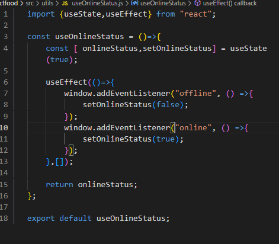
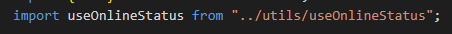
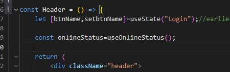
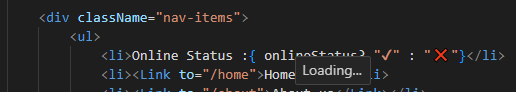
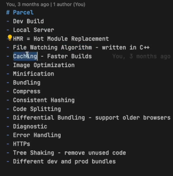
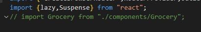
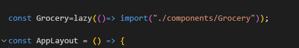
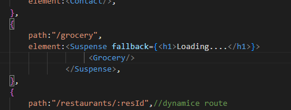

# lecture 9
## custom hooks and single responsilbity function and online ,offline status check

## custom hoo for online ,offline status
### create this hook

### to use it diff component
#### import 
#### decalre ,stor in var 
#### use to check status 

### Parcel

## optimization
### break into small partss>> do logical bundles 
#### All terms are same
- chunking
- code splitting
- lazy loading
- on demand loading
- dynamic handling
- dynamic import

### to imeplment this lazy loading

- falback works like shimmer ui when the grocery part clicked but not render completely this fallback content shown 
- due to lazy loading sep js file loaded when comp called ,which optimises our app
